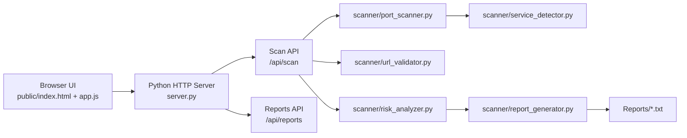

# 6_EYES

6_EYES is a lightweight network security scanner and web dashboard for checking host exposure, identifying open ports, and generating report summaries for security review.

## What it does

- Scans an IP address or domain
- Supports three scan types:
  - common ports
  - single port
  - custom port range
- Detects common services from open ports
- Calculates a simple security score
- Generates a text report file
- Exposes the scanner through a browser UI and a Python HTTP API

## Project structure

```text
6_eyes/
├── server.py                   # Python HTTP server + API entry point
├── public/                     # Browser UI assets
│   ├── index.html
│   ├── app.js
│   └── styles.css
├── scanner/                    # Core scanner modules
│   ├── main.py                 # CLI scanner entry point
│   ├── config.py               # scan default settings and service rules
│   ├── port_scanner.py         # socket-based scanning implementation
│   ├── risk_analyzer.py        # risk and security score logic
│   ├── report_generator.py     # report file creation
│   ├── validator.py            # IP validation
│   ├── url_validator.py        # domain resolution and URL validation
│   └── service_detector.py     # service identification helpers
├── Reports/                    # generated report text files
└── Dockerfile                  # container build definition
```

## Architecture diagram



### High-level flow

1. The user submits a target and scan settings from the web dashboard.
2. The Python server receives the request and routes it to the scanner modules.
3. The scanner tests ports, resolves services, and computes risk metrics.
4. A report file is generated and can be downloaded from the UI.

## Requirements

- Python 3.10+
- Internet access or local DNS resolution for domain scanning
- Optional: Docker for containerized execution

## Run locally

From the project root:

```bash
cd 6_eyes
python server.py
```

Then open:

```text
http://localhost:8000
```

The browser app lets you enter a target host, choose a scan mode, and view live results including risk labels and a downloadable report.

## Run the command-line scanner

If you want to use the terminal-based scanner instead of the dashboard:

```bash
cd 6_eyes
python scanner/main.py
```

## Docker

A basic Docker image is included in the repository:

```bash
cd 6_eyes
docker build -t 6-eyes .
docker run --rm -p 8000:8000 6-eyes
```

## Notes

- The scanner is intended for authorized testing only.
- Be careful when scanning public hosts or networks to avoid violating security policies or local laws.
- Report files are written under the `Reports/` directory.
